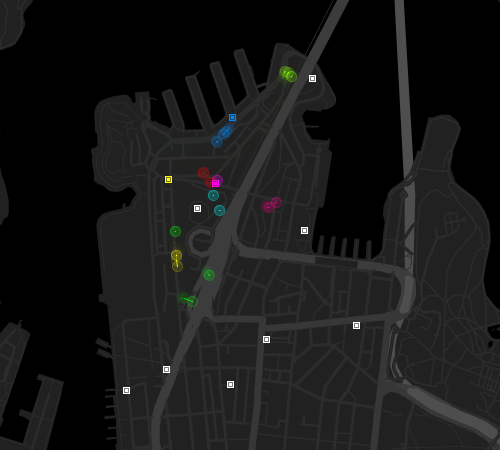

# ICE-O-BAR

This Processing sketch contains code to visualize data from a GPS location based game. Players were split up into eight teams and received clues to a series of locations around Sydney, Australia. Players are represented with circles in the colour of their team, while locations are represented with squares. When a player arrives at a location, the location’s colour is changed to the team’s colour.

## Video

